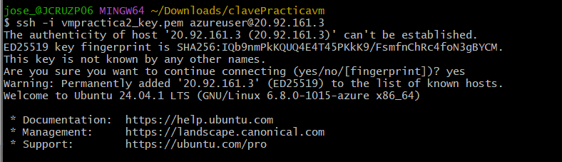
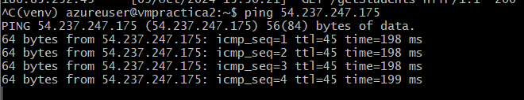
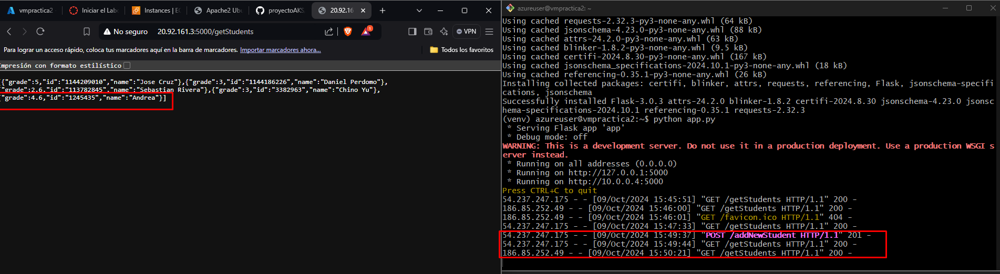

# Practica Multinube usando AZURE y AWS

# Configuración AWS
Se crea una unica instancia usando la practica proporcionada por el curso en AWS.

Overview Intance:


Overview Network Security


# Configuración vm AZURE
Desde la maquina azure se realizan las siguientes configuraciones

* Se realiza una creación de reglas de seguridad en Network settings


* Dentro de la maquina se ingresa usando par de claves ssh 



* Se desea desplgar un app sencilla de appnotas, con python y usando flask para desplegar el app.py es necesario crear un entorno virtual que permita el empaquetado.

**Pruba Ping entre ambas maquinas**

* Desde vm AZURE hacia vm AWS:
```
ping 54.237.247.175

```




* Desde vm AWS hacia vm AZURE
```
ping 20.92.161.3
```


* Global


# Configuración de API vm AZURE

**Instalar virtualenv si no está instalado:**

Si no tienes virtualenv instalado, puedes instalarlo con pip:
bash

```
sudo apt update
sudo apt install python3-venv -y
```
* Crear un entorno virtual venv
```
python3 -m venv venv
```
* Activar entorno virtual
```
source venv/bin/activate
```


# Instalar dependencias

Se instala todas las dependencias requeridas por el API
```
pip install -r requirements.txt
```

# Desplegar aplicación
Prueba inicial 
```
python app.py
```
* Prueba desde maquina aws

**<u>ENDPOINT CONSULTAR ESTUDIANTE</u>**
```
curl -X GET http://20.92.161.3:5000/getStudents
```


Prueba desde navegador web


**<u>ENDPOINT DE AGREGAR NUEVO ESTUDIANTE</u>**
```
curl -X POST http://20.92.161.3:5000/addNewStudent -H "Content-Type: application/json" -d '{ "name" : "Andrea", "id": "1245435", "grade" : 4.6}'
```


Desde navegador web


# Pruebas desde el postman

* get 


* Post

